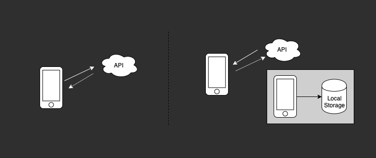
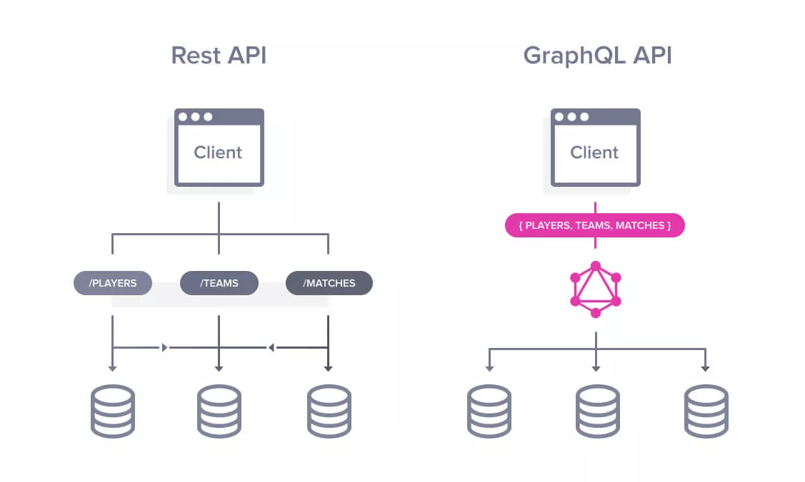
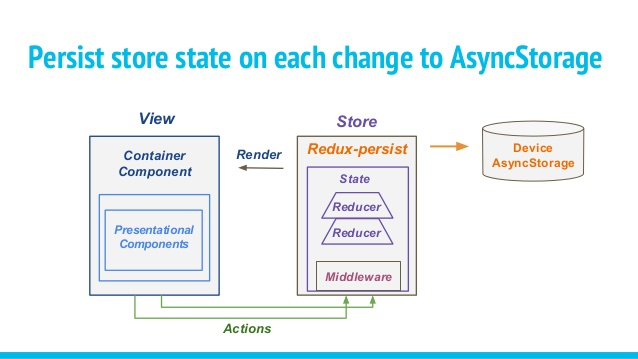

theme: New Story
build-lists: true

# Offline Strategies

## React Native

### Connect.Tech 2019

--- 

# Tim Whitacre

#### Engineering Manager @ New Story Charity

<br>

### :sparkles: [@timwco](https://twitter.com/timwco)
### :sparkles: [@newstorycharity](https://twitter.com/newstorycharity)

---

_We pioneer solutions to end global homelessness._


[newstorycharity.org](https://newstorycharity.org)


---

# Offline First

---

> Offline first is an approach to software development in which developers build an application's core features to function with or without an internet connection. ... This is especially important for end users who travel and experience internet coverage blind spots. [^1]

[^1]: https://whatis.techtarget.com/definition/offline-first

---

# Why Offline First

* Connected & Powered => Disconnected & Battery
* Geography plays an important role
* Offline is simply a fact of life. 🤷

--- 

# Why Now?

* When else are you going to think about it?
* Users demand a better experience

---

# Benefits

- Avoid Local Data Loss
- Speed Up Your App
- Your App Runs Everywhere

---

# Pitfalls

- Data Conflicts
- Diverse Data Types
- Implementation Time
- Others [^2]

[^2]: https://alistapart.com/article/offline-first

--- 

# Offline Syncing Options

- Real Time
  - Data Syncs Upon Connection
  - Progressive Enhancement
- Manual
  - Manually preform a sync operation
  - Architecture Strategy


---

> Offline first requires a mix of UX and Development Strategies. This includes both frontend and backend solutions.

---

> Please don't skip the UX part.

---

# How Do Offline Apps Work? 



--- 

# Local Storage

## 😕

---

```javascript
{
  org_1234: {
    app_status: { last_upload: '2019-09-03T20:59:05+00:00' },
    admin_user: { name: 'Stacy', token: 'ABCDEF123456' },
    data: { ... }
  },
  org_5678: {
    app_status: { last_upload: '2019-10-17T21:33:01+00:00' },
    admin_user: { name: 'Ikenna', token: 'HIJKLMNO789' },
    data: { ... }
  }
}
```

_See a potential problem...?_

---

# Offline Tools

- GraphQL
- Redux Offline/Persist
- Realm

--- 

# GraphQL

#### Only get the data that we need. Less queries, less operations and quicker access to data.



---

```javascript
export const SYNC_DOWNLOAD = gql`
  query Download($lastSyncedAt: ISO8601DateTime) {
    posts(lastSyncedAt: $lastSyncedAt) {
      uuid
      title
      content
      comments {
        uuid
        content
        user_uuid
      }
    }
    authors(lastSyncedAt: $lastSyncedAt) {
      uuid
      first_name
      last_name
    }
    categories(lastSyncedAt: $lastSyncedAt) {
      uuid
      title
    }
  }
`;
```

---

# Redux Offline/Persist

#### Redux Offline allows us to store and "rehydrate" our state as needed. 



---

```javascript
// Store Configure
import { createStore, applyMiddleware, compose } from 'redux';
import { persistStore, persistReducer } from 'redux-persist';
import storage from 'redux-persist/lib/storage';
import { createOffline } from '@redux-offline/redux-offline';
import offlineConfig from '@redux-offline/redux-offline/lib/defaults';
import reducers from './reducers';

const { middleware, enhanceReducer, enhanceStore } = createOffline({ ...offlineConfig, persist: false });

export default key => {

  const persistConfig = { key, storage, blacklist: ['offline', 'user'] };

  const persistedReducer = persistReducer(persistConfig, enhanceReducer(reducers));

  const store = createStore( persistedReducer, compose( enhanceStore, applyMiddleware(middleware)));

  const persistor = persistStore(store);

  return { store, persistor };
};
```

---

```javascript
// App.js
import { Provider as ReduxProvider } from 'react-redux';
import { PersistGate } from 'redux-persist/integration/react';
import configureStore from 'utilities/configure-store';

class App extends Component {
  render () {
    const orgId = getOrganizationId();
    const { store, persistor } = configureStore(orgId);   

    return (
      <ReduxProvider store={store}> // Standard Redux Provider
        <PersistGate persistor={persistor}> // Delays rendering of app
          <MainAppNavigation />
        </PersistGate>
      </ReduxProvider>
    );
  }
}
```

---

# Realm

> Realm Database is a fast, easy to use, and open source alternative to SQLite and Core Data.

* Mobile First
* Simple API, Define Schemas
* Faster than SQLite
* Lazy Queries
* Data Migrations :tada:

---

```javascript
// Realm Models
// models.js
const PostSchema = {
  name: 'Post',
  properties: {
    title:   'string',
    content: 'string',
    comments: 'Comment[]',
    tags: 'Tag[]',
    categories: 'Category[]',
    author: 'Author',
  }
};
const CommentSchema = {
  name: 'Comment',
  properties: {
    author: 'Author',
    comment:   'string',
    approved: 'bool'
  }
};
// Tag Schema
// Author Schema
// Category Schema
```

---

```javascript
// Realm Setup
// realm-setup.js

import models from './db/models'; // { Posts, Comments, Tags, Categories }

const database = async (orgId, schemaVersion) => {

  if (orgId === 'guest') return null; // If no user, no need for a database
  
  const schema = Object.values(models);

  const config = { schema, path: `${orgId}.realm`, schemaVersion };

  return await Realm.open(config);
};
```

---

```javascript
// App.js
import realmSetup from 'utilities/realm-setup'; // Import Realm

class App extends Component {

  render () {
    const schemaVersion = 1;
    const orgId = getOrganizationId();
    const realm = realmSetup(orgId, schemaVersion);

    return (
      <ReduxProvider store={store}> 
        <PersistGate persistor={persistor}>
          <MainAppNavigation screenProps={{ realm }} /> 
        </PersistGate>
      </ReduxProvider>
    );
  }
}
```

---

## Realm Queries

```javascript
// Basic Query
const posts = realm.objects('Post');
posts.forEach(p => console.log(p.title));

// Specific Query (Comments Are Approved)
const comments = realm.objects('Comment');
const posts_comments = comments.filtered('approved = true');

// Posts Sorted Alphabetically
const sortedPosts = posts.sorted('title');

```

---

## Realm Writes

```javascript
// New Comment
const author = realm.objectForPrimaryKey('Author', 1);
const newComment = { author, comment: 'Offline is really cool' };

// Create On it's Own
realm.write(() => realm.create('Comment', newComment));

// Create with Relationship
const post = realm.objectForPrimaryKey('Post', 291);
try {
  realm.write(() => { post.comments.push(newComment)});
} catch (e) {
  console.log('Error Upon Creation');
}
```

---

# Pitfalls

- Maintenance (Active Development)
- Dependency & Upgrades

---

# Review


- UX/UI Strategy
- Local Data Loss (Realm)
- Global State Persistence (Redux Offline/Persist)
- Diverse Data Types (Realm, GraphQL)
- Data Conflicts (Realm, GraphQL)

---

# Thank You

### :link: [l.timw.co/ctech2019](https://l.timw.co/ctech2019)

#### :sparkles: [@timwco](https://twitter.com/timwco)

#### :sparkles: [@newstorycharity](https://twitter.com/newstorycharity)

---

# Image Credits

- [Devopedia](https://devopedia.org/graphql)
- [@andreee](https://medium.com/@andreee/bagaimana-cara-membuat-state-di-redux-mu-abadi-menggunakan-redux-persist-946fae62b7b5)
- [New Story Charity](https://newstorycharity.org)